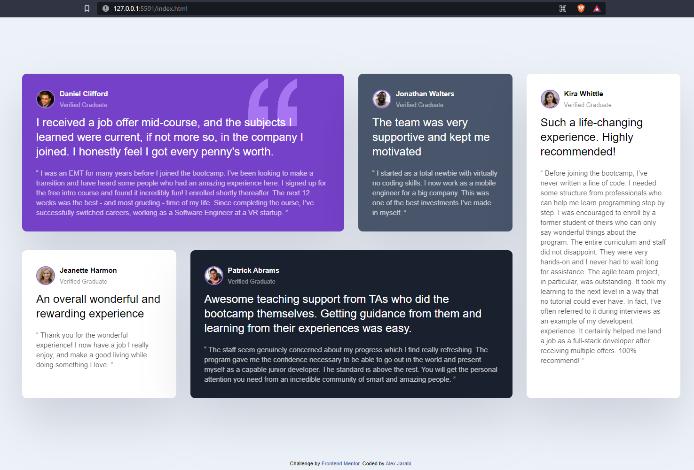

# Frontend Mentor - Testimonials grid section solution

This is a solution to the [Testimonials grid section challenge on Frontend Mentor](https://www.frontendmentor.io/challenges/testimonials-grid-section-Nnw6J7Un7). Frontend Mentor challenges help you improve your coding skills by building realistic projects.

## Table of contents

- [Overview](#overview)
  - [The challenge](#the-challenge)
  - [Screenshot](#screenshot)
  - [Links](#links)
- [My process](#my-process)
  - [Built with](#built-with)
  - [What I learned](#what-i-learned)
  - [Continued development](#continued-development)
  - [Useful resources](#useful-resources)
- [Author](#author)
- [Acknowledgments](#acknowledgments)

**Note: Delete this note and update the table of contents based on what sections you keep.**

## Overview

This is a challenge to test knowledge on CSS grid. Web technologies used are HTML and CSS

### The challenge

Users should be able to:

- View the optimal layout for the site depending on their device's screen size

### Screenshot



### Links

- Solution URL: [https://github.com/Jarabi/Testimonial-Grid-Challenge]
- Live Site URL: [https://jarabi.github.io/Testimonial-Grid-Challenge/]

## My process

1. Started by going through the instructions and making sure I have everything I need
2. Build out the layout and the cards first without the CSS
3. Apply colors and design to the cards as specified
4. Use Grid to align the cards
5. Use flexbox within the cards for spacing and alignment between card alements
6. Change layout of items when screen size changes using media queries

### Built with

- Semantic HTML5 markup
- CSS custom properties
- Flexbox
- CSS Grid

### What I learned

It is easier to break down the process into smaller tasks, for example, build out the skeleton and get everything in there; next apply styles, and so on. I also enjoyed learning grid to align the cards on the page. It is very easy to align page markup "grid-template-columns". For example:

```css
.testimonials {
  display: grid;
  grid-template-columns: repeat(4, 1fr);
  gap: 30px;
}
```

### Continued development

I will continue focusing on CSS development and learning how to easily customize beautiful pages. After this, I will proceed to another Frontedn Mentor challenge.

### Useful resources

- W3 Schools (https://www.w3schools.com/css/css_grid.asp) - This resource helped me with CSS grid layout.

## Author

- Frontend Mentor - [@Jarabi] (https://www.frontendmentor.io/profile/Jarabi)
- Twitter - [@jarabialex] (https://www.twitter.com/jarabialex)

## Acknowledgments

I got a lot of help from Traversy meadia channel on YouTube about how to style and align pages.
